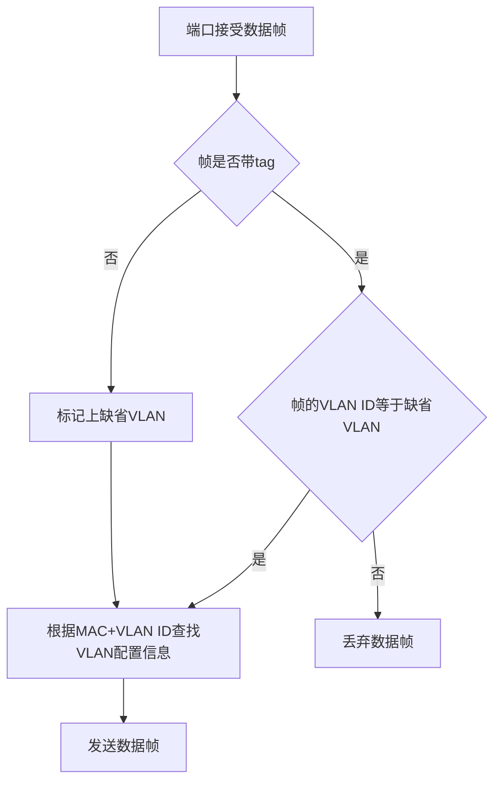
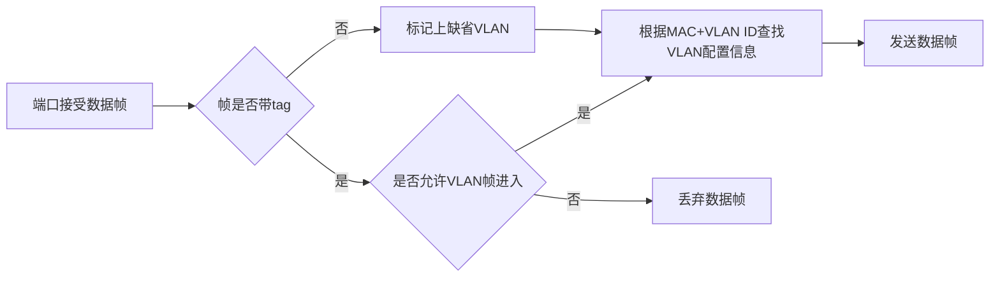
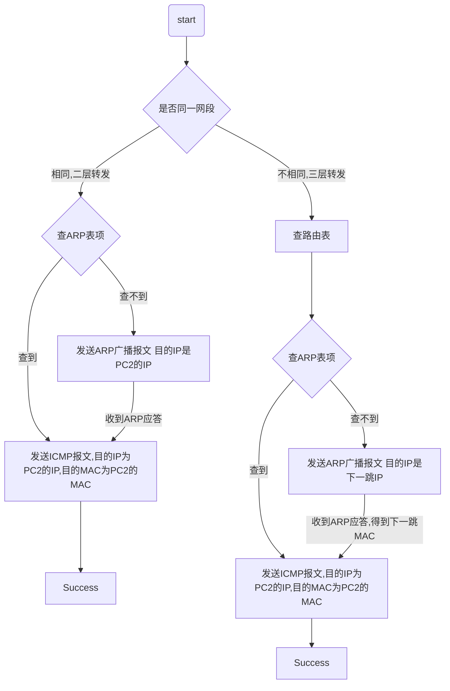
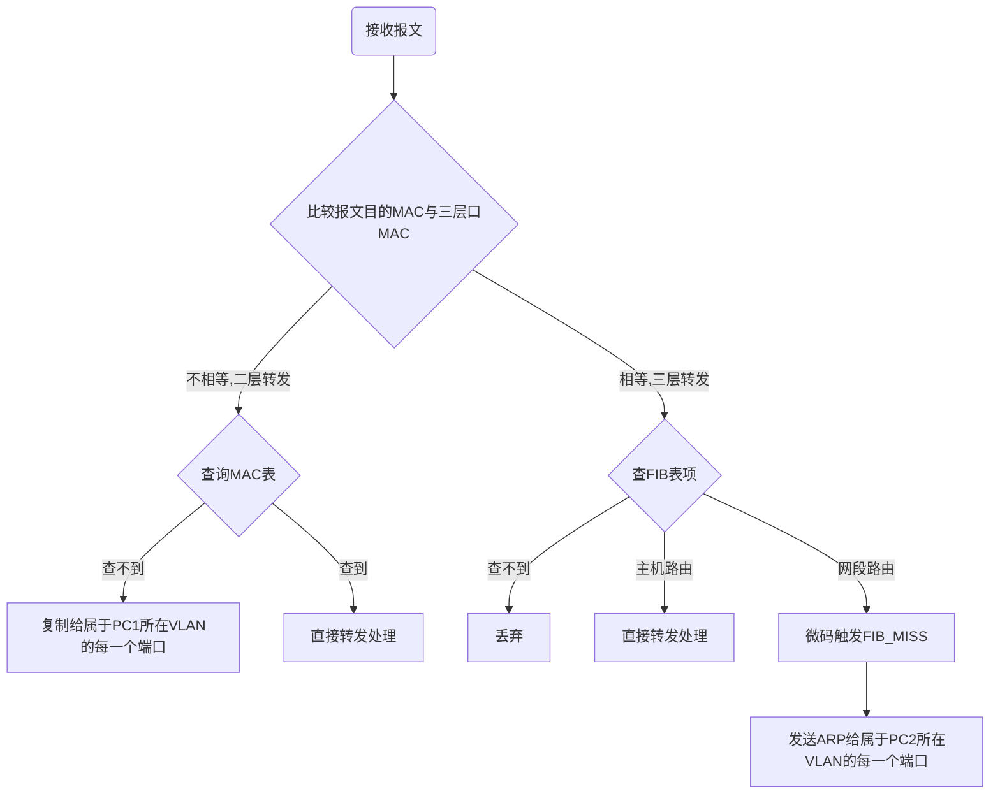

> 最近在华为数通产品线实习，这里分享一些不涉及业务的基础原理学习笔记

# 二三层基础

## VLAN的转发原则

在进入交换机内部时，所有数据包都是带tag的

**进：**

* 带tag数据包：比较tag与接受端口所属的VLAN的VID，如果有匹配的，接收数据包，并在匹配的VLAN转发；否则，丢弃。
* 收到不带tag的数据包，在PVID对应的VLAN内转发。

**出**：

* 从taged端口转发：数据包带802.1Q标签
* 从untagged转口转发：数据包发出去之前删除802.1Q标签

## VLAN的划分 

VLAN可以基于端口、MAC地址、子网和协议划分

### 基于端口划分

Access端口：连接的设备不识别802.1Q帧（通常连接主机）。端口只能以untagged的方式从属于唯一个VLAN。

Trunk端口：端口能以tagged的方式从属于多个VLAN，以untagged的方式属于一个VLAN（PVID对应的VLAN）。

Hybrid端口：能以tagged的方式属于某些VLAN，以untagged的方式属于另外一些VLAN。

QinQ：不管有无tag，统一再加一层tag。

#### Access端口

**配置：**

* `port link-type access`:表示端口6/0/5以access方式加入vlan 5
* `port default vlan 5`：端口的默认vlan-id是5,当收到untag报文时，就给报文打上vlan为5的tag；端口允许vlan为5的报文通过

接收：

untag:为报文加上默认VLAN tag

tag：当VLAN ID与缺省VLAN ID 相同，接收报文，否则丢弃

发包：

VLAN ID 就是缺省VLAN ID，去掉tag，发送报文

#### Trunk端口

**配置：**

* `port link-type trunk`：表示端口6/0/5以trunk方式加入vlan 5
* `port trunk pvid vlan5`：端口的默认vlan-id是5，当收到untag报文时，就给报文打上vlan为5的tag
* `port trunk allow-pass vlan 5`：只允许带vlan tag 5的报文通过

**收包：**

untag: 默认VLAN ID在该端口允许通过的VLAN ID列表内时,给该报文打赏缺省VLAN的tag，否则丢弃

tag:当VLAN ID在允许通过VLAN ID列表内时，接受该报文；否则丢弃

**发包：**

当VLAN ID和缺省VLAN ID相同且是该端口允许通过的VLAN ID， 去掉tag并转发；

当VLAN ID和缺省VLAN ID 不同且是该端口允许通过的VLAN ID，保持原有tag,发送该报文

#### Hybrid端口

**配置：**

* `port hybrid pvid vlan 5`：表示端口加入vlan的方式为hybrid，默认vlan为5
* `port hybrid tagged vlan 6`：端口允许带tag vlan 6的报文进出，不处理报文的tag
* `port hybrid untagged vlan 5`：端口允许带tag vlan 5的报文进出，但是出去时会将报文的tag剥掉

**收包：**

untag:默认VLAN ID在该端口允许通过的VLAN ID列表内时,给该报文打赏缺省VLAN的tag，否则丢弃

tag:当VLAN ID在允许通过VLAN ID列表内时，接受该报文；否则丢弃

**发包：**

当报文中携带的VLAN ID是该端口允许通过的VLAN ID时，发送该报文，并可以通过`port hybrid vlan`命令配置端口在发送该VLAN（包括缺省VLAN）的报文时是否携带tag

## VLAN的网络功能

两层交换，三级路由

### VLAN二层交换的规则

* 主机与交换机之间传递的是UNTAGGED报文
* 交换机之间用干道链路TRUNK链接
* 交换机用TAG来标识报文所属的VLAN
* 干道链路上传输的是TAGGED FRAME
* 不同VLAN之间在二层不能通信

## VLAN聚合

节约大量IP地址：广播（全1）、子网（0）、网关（1），扩展容易

一个Super-VLAN包含一个或多个Sub-VLAN，共用一个网段

## QinQ

再包一层tag（双层tag）

节约VLAN资源，可支持多达4094*4094个VLAN，满足网络需求

## 二三层转发

### 二三层转发判断

**发送端二三层转发判断：**

源IP地址&网关源码==目的IP地址&网关掩码？同一网段二层转发：非同一网段三层转发

**接收端二三层转发的判断：**

报文目的MAC==本端口的MAC？设备内三层转发：设备内二层转发

#### PC发送处理流程

#### 接收端转发流程

