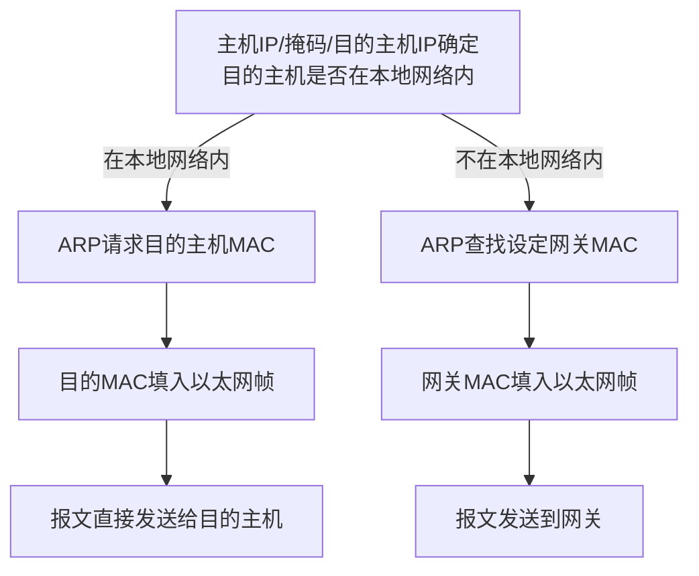

> 最近在华为数通产品线实习，这里分享一些不涉及业务的基础原理学习笔记

# TCP/IP

## 1 TCP/IP体系结构

OSI七层网络模型：物理层 链路层 网络层 传输层 会话层 表示层 应用层

TCP/IP五层 ：物理层 链路层 网络层 传输层 应用层 

## 2 TCP/IP能做什么

通信

## 3 链路层的作用

1.管理物理信道

2.向IP层提供服务

3.成帧

4.流量控制和差错控制（部分）

5.复用链路（部分）

## 4 IP层

### 4.1 IP地址分类

A类：0 Network(7bit) Host(24bit)

B类：10 Network(14bit) Host(16bit)

C类：110 Network(21bit) Host(8bit)

D类：1110 组播地址

E类：11110 保留

Host 全“0“：网络地址， 代表一个网段

Host全“1”：广播地址，特定网段所有节点

**地址是基于网络端口，而不是基于设备的**

### 4.2网段

1.一个网段就是一个广播域

2.网段内部是相同的链路层

3.网段内部的转发不需要通过三层设备

**子网划分：**

原则：IP地址中，网段部分增加，主机部分减少

划分多少个子网，则掩码相应增长

每个子网网段地址在网段增长部分取不同的值

例：192.168.1.0 / 255.255.255.0划分为2个子网：

–192.168.1.0 / 255.255.255.128

–192.168.1.128 / 255.255.255.128

### 4.3 IP转发

**路由选路：最长匹配**

根据报文的目的地址，与路由项进行匹配操作；

匹配的动作是用报文目的地址与路由项的子网掩码进行“与”

如果“与”的结果和路由项中网络地址相同，则认为路由匹配

所有匹配项中子网掩码位数最长的为最佳匹配项，报文据此进行转发（从该表项对应接口发送）

如果找不到匹配项，则根据缺省路由0.0.0.0/0进行转发

如果没有缺省路由则报文被丢弃 

* 相同网段内部的通信，通过二层功能完成互通，当主机与对端主机通信的时候，根据自身的IP地址和子网掩码来确定对方是否在系统网段内，如果判定在相同网段内，则直接通过ARP查找对方的MAC地址，然后把对方的MAC地址填入以太网帧头的目的MAC地址域
* 不同网段的主机通信的时候，主机发现对方在不同的网段内，则主机就会自动借助网关来进行通信，主机首先通过ARP来查找设定的网关的MAC地址，然后把网关的MAC地址（而不是对方主机的MAC地址，因为主机认为通信对端不是本地主机）填入以太网帧头的目的MAC地址域

## 5 MPLS

MPLS——Multi-Protocol Label Switching

• Multi-Protocol：支持多种三层协议，如IP、IPv6、IPX、等

• Label Switching：给报文打上标签，以标签交换取代IP转发

2.5层协议：位于网络层和链路层之间

## 6 IPv6

128位地址：每一粒沙子都可以分配一个IPV6地址

* 试图解决IPV4不能解决的问题：
  * IP地址短缺
  * 安全性
  * 移动性
  * QOS

